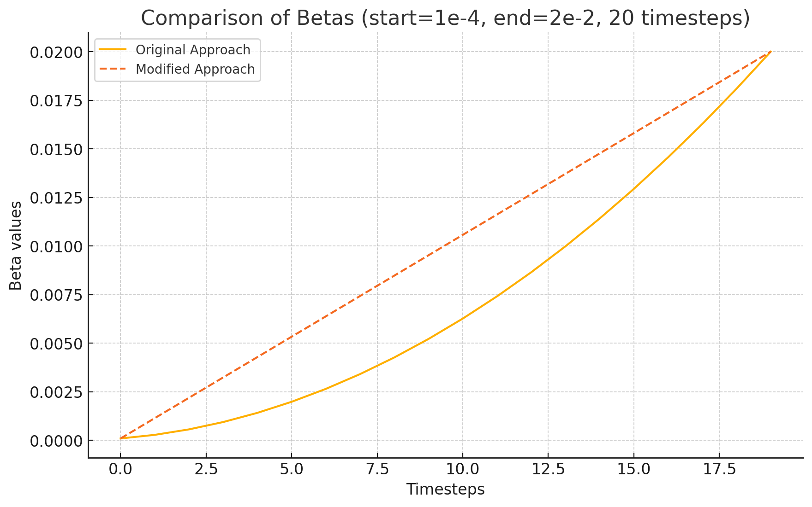
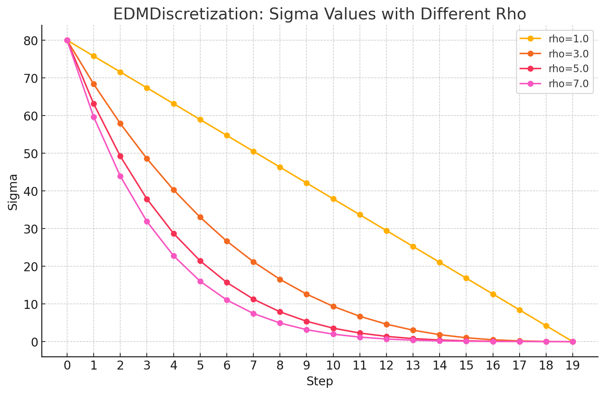
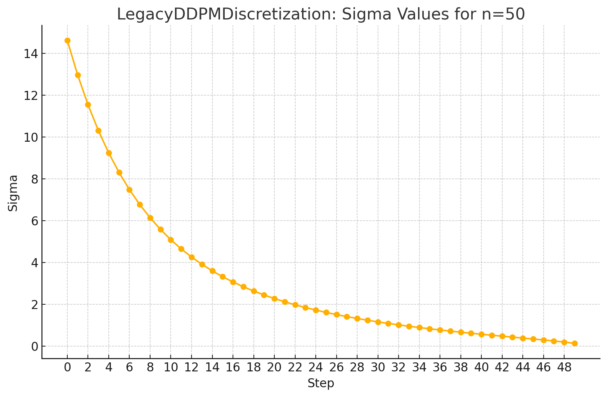

# Technical note on SDXL
Note: This document is still work in progress and is a very early draft.

This document covers how SDXL works on Cremage.

# Code
Main flow is defined in:
./modules/sdxl/sdxl_pipeline/sdxl_image_generator.py

generate() is the entry point.

Major steps are the following:
1. Model instantiation (init_st)
1. Weight loading (load_state_dict_into_model)
    If refiner is specified, then it goes through model instantiation code as well.
1. Sampler (denoiser) instantiation (init_sampling)
1. Wildcards resolution (resolve_wildcards)
1. txt2img (run_txt2img) or img2img (run_img2img)
1. Refiner (apply_refiner)

# Model instantiation
Code: init_st (modules/sdxl/sdxl_pipeline/sdxl_image_generator_utils.py)

* Load LoRA models (load_loras)
* Instantiate the main model (instantiate_model_from_config, instantiate_from_config)

## Configs for model instantiation
Step 1: Get the config file name from the model key
VERSION2SPECS (modules/sdxl/sdxl_pipeline/sdxl_image_generator.py)
  key: model key ("SDXL-base-1.0", or "SDXL-refiner-1.0")
  value: config file name, et al

Step 2: Instantiate the model using the definitions in config
Config file location: modules/sdxl/configs/inference/sd_xl_base.yaml

Object to instantiate is sgm.models.diffusion.DiffusionEngine.
Shown below is the config used to instantiate this object:
```
model:
  target: sgm.models.diffusion.DiffusionEngine
  params:
    scale_factor: 0.13025
    disable_first_stage_autocast: True

    denoiser_config:
      target: sgm.modules.diffusionmodules.denoiser.DiscreteDenoiser
      params:
        num_idx: 1000

        scaling_config:
          target: sgm.modules.diffusionmodules.denoiser_scaling.EpsScaling
        discretization_config:
          target: sgm.modules.diffusionmodules.discretizer.LegacyDDPMDiscretization

    network_config:
      target: sgm.modules.diffusionmodules.openaimodel.UNetModel
      params:
        adm_in_channels: 2816
        num_classes: sequential
        use_checkpoint: True
        in_channels: 4
        out_channels: 4
        model_channels: 320
        attention_resolutions: [4, 2]
        num_res_blocks: 2
        channel_mult: [1, 2, 4]
        num_head_channels: 64
        use_linear_in_transformer: True
        transformer_depth: [1, 2, 10]
        context_dim: 2048
        spatial_transformer_attn_type: softmax-xformers

    conditioner_config:
      target: sgm.modules.GeneralConditioner
      params:
        emb_models:
          - is_trainable: False
            input_key: txt
            target: sgm.modules.encoders.modules.FrozenCLIPEmbedder
            params:
              layer: hidden
              layer_idx: 11

          - is_trainable: False
            input_key: txt
            target: sgm.modules.encoders.modules.FrozenOpenCLIPEmbedder2
            params:
              arch: ViT-bigG-14
              version: laion2b_s39b_b160k
              freeze: True
              layer: penultimate
              always_return_pooled: True
              legacy: False

          - is_trainable: False
            input_key: original_size_as_tuple
            target: sgm.modules.encoders.modules.ConcatTimestepEmbedderND
            params:
              outdim: 256

          - is_trainable: False
            input_key: crop_coords_top_left
            target: sgm.modules.encoders.modules.ConcatTimestepEmbedderND
            params:
              outdim: 256

          - is_trainable: False
            input_key: target_size_as_tuple
            target: sgm.modules.encoders.modules.ConcatTimestepEmbedderND
            params:
              outdim: 256
        lora_ranks: None
        lora_weights: None
    first_stage_config:
      target: sgm.models.autoencoder.AutoencoderKL
      params:
        embed_dim: 4
        monitor: val/rec_loss
        ddconfig:
          attn_type: vanilla-xformers
          double_z: true
          z_channels: 4
          resolution: 256
          in_channels: 3
          out_ch: 3
          ch: 128
          ch_mult: [1, 2, 4, 4]
          num_res_blocks: 2
          attn_resolutions: []
          dropout: 0.0
        lossconfig:
          target: torch.nn.Identity
```
## Instantiation of DiffusionEngine class 
Code: modules/sdxl/sgm/models/diffusion.py
Here are the main items that take place:
* Unet model instantiation
* Denoiser instantiation
* Sample instantiation if sampler config is not none
* Conditioner instantiation
* VAE (first stage) initialization
* Loss func initialization

### Conditioner
Object: sgm.modules.GeneralConditioner
Conditioners that are defined are:
* Text embedding 1 (FrozenCLIPEmbedder)
* Text embedding 2 (FrozenOpenCLIPEmbedder2) ViT-bigG-14, laion2b_s39b_b160k
* original_size_as_tuple (target: sgm.modules.encoders.modules.ConcatTimestepEmbedderND)
* crop_coords_top_left (target: sgm.modules.encoders.modules.ConcatTimestepEmbedderND)
* target_size_as_tuple (target: sgm.modules.encoders.modules.ConcatTimestepEmbedderND)

Note that options for some of the embedders are set in run_txt2img method as shown below:
```
def run_txt2img (sdxl_image_generator.py)
...
    W, H = opt.W, opt.H
...
    init_dict = {
        "orig_width": W,
        "orig_height": H,
        "target_width": W,
        "target_height": H,
    }
    value_dict = init_embedder_options(
        get_unique_embedder_keys_from_conditioner(state["model"].conditioner),
        init_dict,
        prompt=positive_prompt,
        negative_prompt=negative_prompt,
    )
...
def init_embedder_options (sdxl_image_generator_utils.py)
...
      if key == "original_size_as_tuple":
            orig_width = init_dict["orig_width"]  # 1024
            orig_height = init_dict["orig_height"]  # 1024
            
            value_dict["orig_width"] = orig_width
            value_dict["orig_height"] = orig_height

        if key == "crop_coords_top_left":
            crop_coord_top = 0
            crop_coord_left = 0
            
            value_dict["crop_coords_top"] = crop_coord_top
            value_dict["crop_coords_left"] = crop_coord_left
...
        if key == "target_size_as_tuple":
            value_dict["target_width"] = init_dict["target_width"]
            value_dict["target_height"] = init_dict["target_height"]
```

# Beta schedule
Code: make_beta_schedule in modules/sdxl/sgm/modules/diffusionmodules/util.py
Used in LegacyDDPMDiscretization which is discussed next.
Example for n_timestep set to 20:
```
    [0] 0.0001
    [1] 0.00028618196189870196
    [2] 0.0005680513081478406
    [3] 0.0009456080387474158
    [4] 0.0014188521536974274
    [5] 0.001987783652997876
    [6] 0.002652402536648761
    [7] 0.003412708804650082
    [8] 0.004268702457001841
    [9] 0.0052203834937040354
    [10] 0.006267751914756668
    [11] 0.007410807720159736
    [12] 0.008649550909913243
    [13] 0.009983981484017183
    [14] 0.011414099442471562
    [15] 0.012939904785276376
    [16] 0.014561397512431625
    [17] 0.016278577623937317
    [18] 0.01809144511979344
    [19] 0.02
```

<figure>
  
  <figcaption>Example of beta schedule (Original approach)</figcaption>
</figure>

This also chart illustrates a hypothetical schedule (Modified) where the values are directly linearly interpolated without being raised to the 0.5th power first, and the results are not squared.

Note that the values shown above are for illurastrative purpose only. Default values that are used for DDPM discretizer are the following:
* linear_start=0.00085
* linear_end=0.0120

# Discretizer
Code: modules/sdxl/sgm/modules/diffusionmodules/discretizer.py
Goal is to return a list of numbers (noise schedule) to be used by the sampler.
This list is called sigmas, so you can consider this as a "sigma generator".

Two types of discretization is supported:
* EDMDiscretization
* LegacyDDPMDiscretization

## EDMDiscretization
Example for n set to 20:
```
  [0] 79.99998474121094
  [1] 59.657501220703125
  [2] 43.920257568359375
  [3] 31.88442039489746
  [4] 22.794111251831055
  [5] 16.02229881286621
  [6] 11.05366325378418
  [7] 7.468902587890625
  [8] 4.930656909942627
  [9] 3.1708412170410156
  [10] 1.979400634765625
  [11] 1.1943087577819824
  [12] 0.6928236484527588
  [13] 0.3838551640510559
  [14] 0.20140404999256134
  [15] 0.09897341579198837
  [16] 0.04488256946206093
  [17] 0.01840081810951233
  [18] 0.006621698383241892
  [19] 0.0019999996293336153
```
<figure>
  
  <figcaption>Example of EDM discretization</figcaption>
</figure>


Code to compute sigma is shown below:
```
    def get_sigmas(self, n, device="cpu"):
        ramp = torch.linspace(0, 1, n, device=device)
        min_inv_rho = self.sigma_min ** (1 / self.rho)
        max_inv_rho = self.sigma_max ** (1 / self.rho)
        sigmas = (max_inv_rho + ramp * (min_inv_rho - max_inv_rho)) ** self.rho
        return sigmas
```
In addition to start (max) and end (min) values, a parameter called rho is used to compute the sigma schedule. If rho is 1, the line becomes straight. The higher the rho, the more curvature will be added to the curve.

In Cremage, sigma_max, sigma_min, rho are defined as user-definable values that can be confired in the UI.

Default values are defined as following (modules/cremage/configs/preferences.py):
```
            "discretization_sigma_min": 0.0292,
            "discretization_sigma_max": 14.6146,
            "discretization_rho": 3.0,
```

During sampler initialization, get_discretization method (modules/sdxl/sdxl_pipeline/sdxl_image_generator_utils.py) grabs these values and constructs a dictionary that hold these values along with the class name EDMDirecretization. This dictionary is passed to a sampler initializer where the Discretization object is instantiated as a member of the sampler object.

## Legacy DDPM Discretization

Sigma values are the following when n=50.
```
[0] 14.614641189575195
[1] 12.966320991516113
[2] 11.542771339416504
[3] 10.309401512145996
[4] 9.237422943115234
[5] 8.302803039550781
[6] 7.485421180725098
[7] 6.768382549285889
[8] 6.137460708618164
[9] 5.580644607543945
[10] 5.08776330947876
[11] 4.650183200836182
[12] 4.260556697845459
[13] 3.9126131534576416
[14] 3.6009886264801025
[15] 3.3210830688476562
[16] 3.0689430236816406
[17] 2.8411612510681152
[18] 2.634795665740967
[19] 2.4472994804382324
[20] 2.276463031768799
[21] 2.1203653812408447
[22] 1.977332353591919
[23] 1.8459018468856812
[24] 1.7247940301895142
[25] 1.6128861904144287
[26] 1.5091912746429443
[27] 1.4128390550613403
[28] 1.3230608701705933
[29] 1.2391756772994995
[30] 1.1605783700942993
[31] 1.0867294073104858
[32] 1.0171462297439575
[33] 0.9513954520225525
[34] 0.8890852332115173
[35] 0.8298594951629639
[36] 0.773391842842102
[37] 0.7193796038627625
[38] 0.6675384640693665
[39] 0.6175960898399353
[40] 0.5692849159240723
[41] 0.5223334431648254
[42] 0.47645437717437744
[43] 0.4313262701034546
[44] 0.3865651786327362
[45] 0.3416738212108612
[46] 0.29594171047210693
[47] 0.24822042882442474
[48] 0.19630272686481476
[49] 0.13445067405700684
```

<figure>
  
  <figcaption>Example of DDPM discretization</figcaption>
</figure>

Unlike EDM where sigma values are determined by the simple calculation using the initial value, final value, rho (curvature), sigmas for DDPM discretization requires a little more steps. They are:
1. Compute beta (how much noise at a step do you want to add during forward diffusion)
1. Compute alpha from beta (how much of the image do you want to keep)
1. Compute the cumulative product of alpha (overall retention of image)
1. Compute sigmas from the cumulative product of alpha

Refer to [DDPM cumprod alpha example values](ddpm_cumprod_alpha_example_values.md) to see example values computed for default parameters of beta.

# Guider
Code: modules/sdxl/sgm/modules/diffusionmodules/guiders.py
* IdentityGuider
* VanillaCFG

## Identify Guider
Copies input, or returns input as output. Consider this as a no-op.

## Identify Guider
Vanilla CFG. Implements classifier-free guidance.
First prepares the input by concatenating uc (negative prompt) and c (positive prompt) embeddings and doubling the elements of x (noisy image). Batch size becomes 2x due to 
this processing.
Then model output is split into uc-based output and c-based output. Then it applies
CFG formula:
output = uc + cfg_scale * (c - uc)

When cfg_scale = 0, output = uc.
When cfg_scale = 1, output = c.
You can consider output as a multiple of vectors that moves away from uc towards c.
Interestingly, you can also specify a negative value for cfg scaling parameter.
Then, the negative semantic meaning of positive prompt is added to the output.

# Samplers
Code: modules/sdxl/sgm/modules/diffusionmodules/sampling.py

Attributes
* Discretization
* Guider

Input
* Number of steps
* Discretization config
* Guider config

