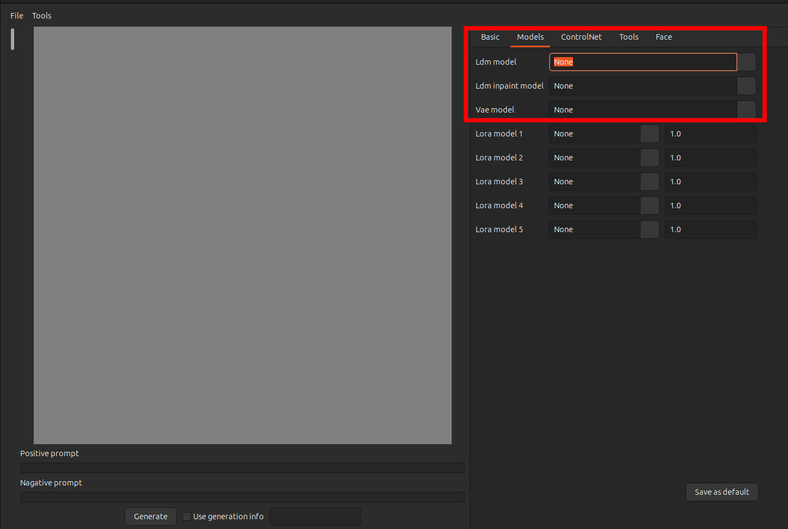
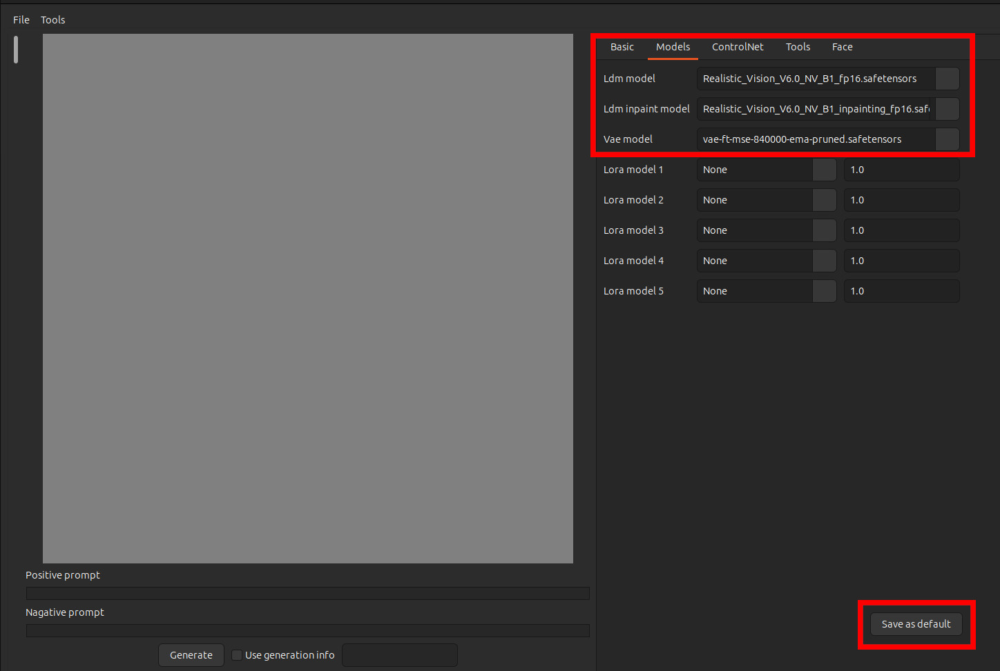
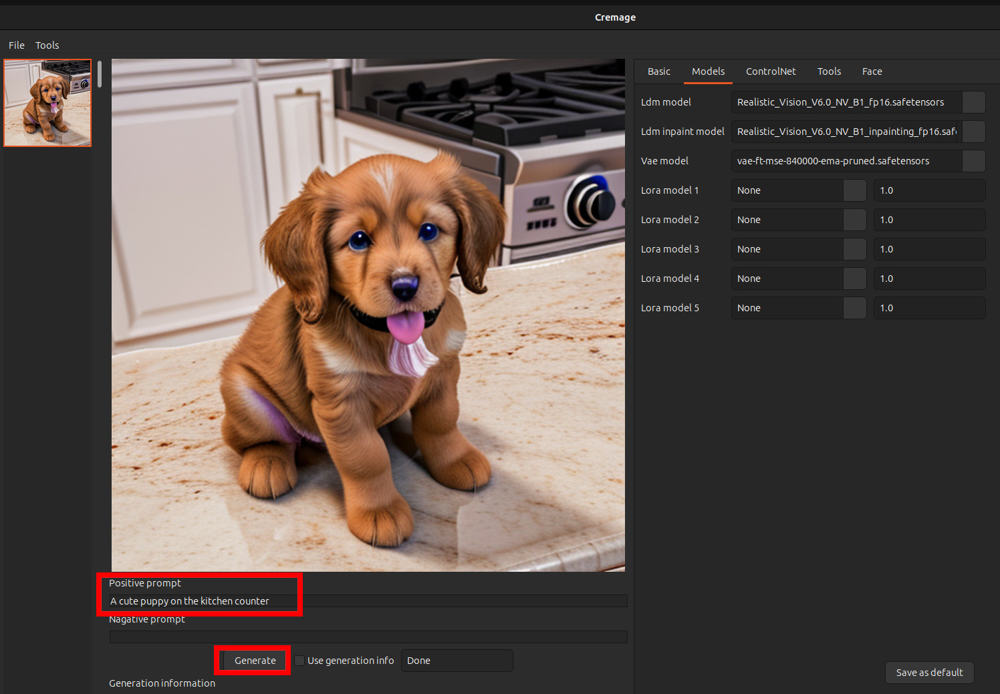

# Getting Started with Cremage

If you haven't done so, please complete the installation following the Refer to [Installation Guide](docs/installation_guide.md "View the Installation Guide").
Make sure that you have also downloaded the models and placed under the Cremage installation directory.

# Steps
## Starting Cremage
Go to terminal and change to the directory where you installed Cremage and type:
```
conda activate cremage
python cremage_main.py
```
This should bring up the application. If the UI does not come up, check for errors in the console output.  Most likely it is caused by installation issues. Go back to the installation guide and make sure that you have completed all the steps without errors.

Click the Models tab on the top right. You should see below:


Select the LDM model, LDM inpaint model and VAE model, and Save as default.


Type: "A cute puppy on the kitchen counter" and press Generate. You should see something similar to below.
