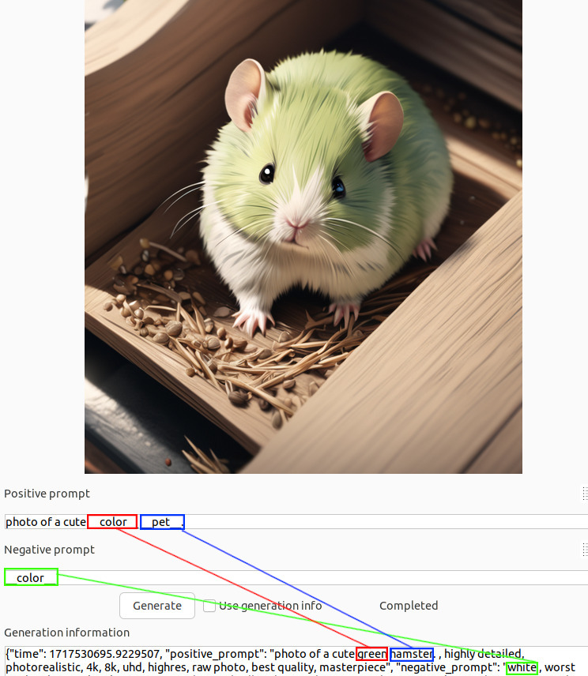

# How to Use Wildcards



The wildcards feature allows you to replace a part of the prompt with a randomly selected choice from a pre-defined set of words.

For example, consider this prompt:

```
A photo of a cute __pet__.
```

If you define the following in pet.txt:
```
dog
cat
```

The word \_\_pet\_\_ will be replaced by "dog" or "cat" during image generation.

To use wildcards, follow these steps:
1. Define a set of words in a text file and place the file under `data/wildcards` in your Cremage installation directory. The file name should be the word that represents the wildcard followed by the ".txt" file extension (e.g., `data/wildcards/pet.txt`).
2. Specify this file by placing two underscores before and after the file name without the extension.

```
A photo of a cute __pet__.
```

Nested wildcards are also supported. If `pet.txt` contains:
```
__dog__
cat
```
and `dog.txt` contains:
```
St. Bernard
Golden Retriever
```

Then, \_\_pet\_\_ can resolve to St. Bernard, Golden Retriever, or cat.