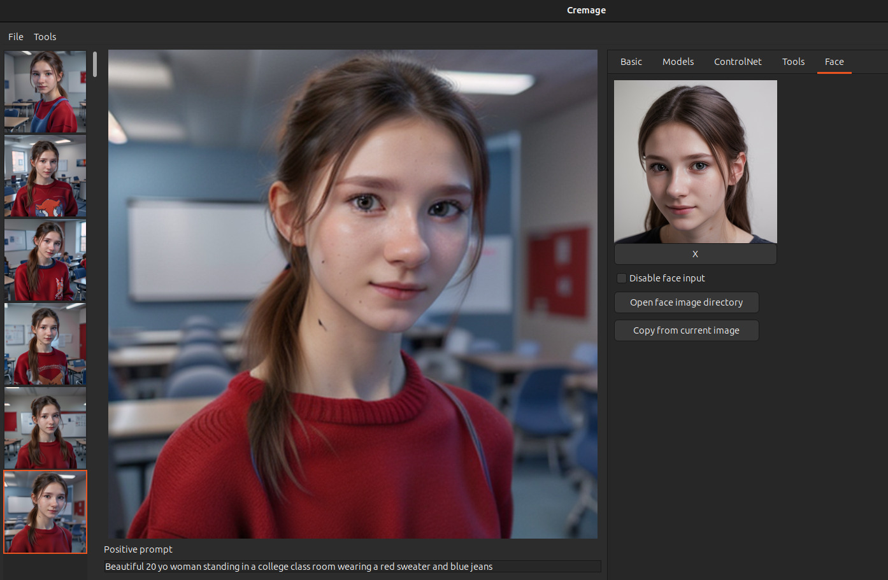

Welcome to Cremage.

Cremage is designed with the following goals in mind:

1. Make it easy to generate images even if you are not familiar with AI.
2. Make it easy for a power user for tweak new images as well as previously generated images.

For example, if you are starting out with AI image generation, you can just enter positive prompt and press the Generate button to create images without tweaking any options.

You can also go back to any of the previously generated image and tweak as Cremage provides the same image editing capability irrespective of whether it's newly generated or images generated months ago.

# High quality face generation
Cremage offers face fix capability which was pioneered by Adetailer for Automatic1111. Cremage allows you to improve face during and after image generation, resulting in high quality face images.

In addition, with fully integrated IP-Adapter-FaceID, you can generate consistent face across multiple images.

# Installation
Refer to [Installation Guide](docs/installation_guide.md "View the Installation Guide")

# User's guide
Cremage is designed to make it intuitive to use, but there are still things that are not obvious.  I recommend you have a quick look at [User's Guide](docs/users_guide.md "View the User's Guide")

# Usage Restrictions

## Non-commercial Use
**Cremage** is initially released for non-commercial research purposes only; however, this status is subject to change. If you are interested in using it commercially, please contact me at support@candee.ai.

## Not Suitable for Minors or Those Sensitive to Potentially Offensive Content

While **Stable Diffusion** is a powerful and versatile tool for image creation, it has the potential to generate content that may be inappropriate for minors. Additionally, **Stable Diffusion** can occasionally produce images that some users might find offensive.

The **Cremage** software includes a feature designed to filter out sensitive content; however, this filter is not foolproof and may not effectively screen all such content. As a result, **Cremage** is not suitable for use by minors.

By choosing to use **Cremage**, users acknowledge and accept the risks associated with potential exposure to inappropriate or offensive content.

## Lawful and Ethical Purposes Only

Users are reminded that **Cremage** must be used only for lawful and ethical purposes. This includes refraining from using the software to generate images of any real person without the explicit consent of the individuals whose likenesses are to be used. Users assume full responsibility for ensuring their use of the software complies with all applicable laws and ethical standards.

# Reporting bugs
The best way to report a bug is to create an issue on github.

I hope you will enjoy generating artwork!