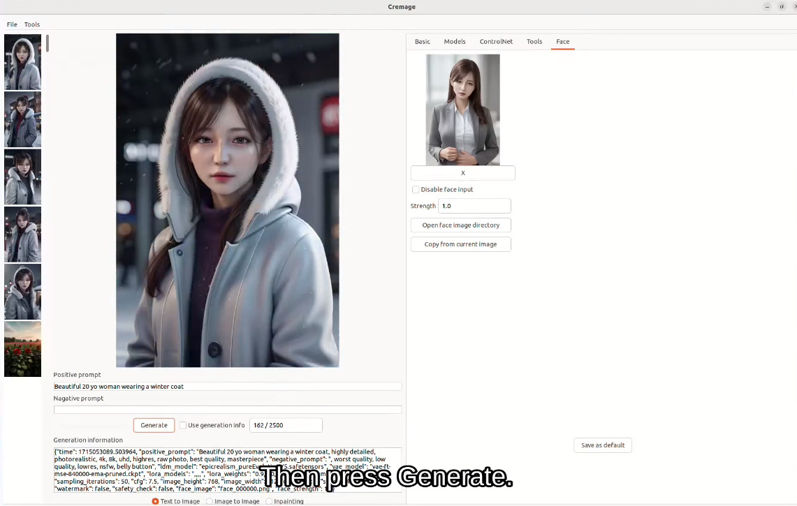
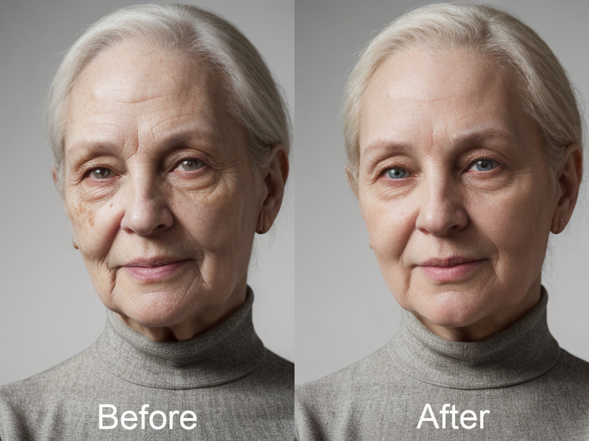
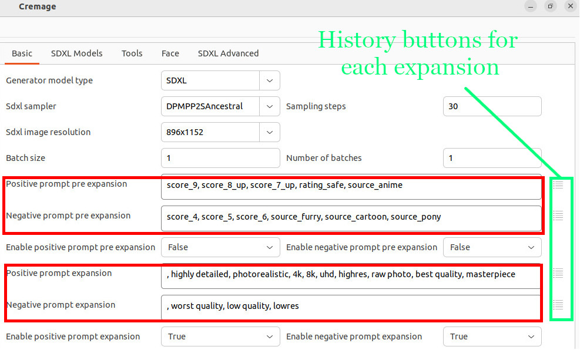
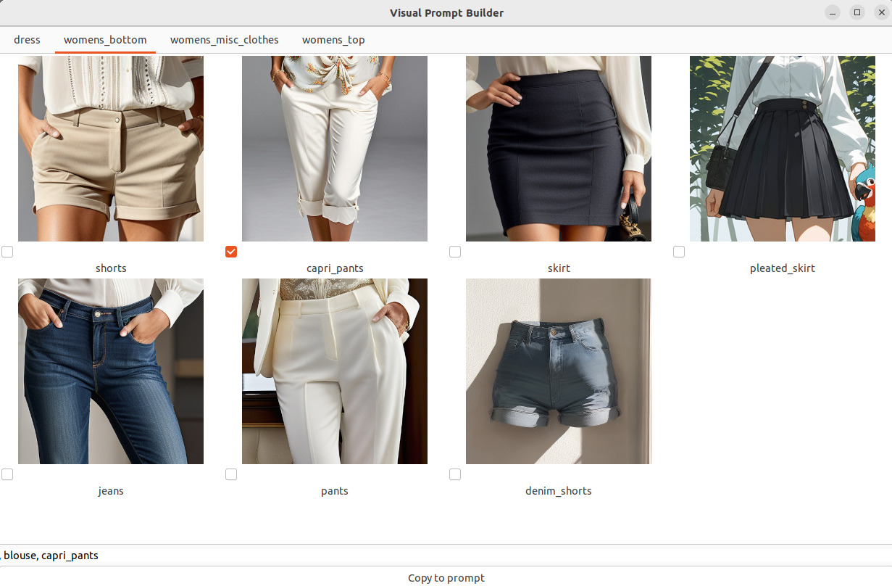

## Updates
July 17, 2024:
PixArt-Σ (Pixart Sigma) support has been added. Only text to image flow is supported for now.

This is a breaking change and requires your action if you have already installed Cremage. Please add the following lines in config.yaml:
```
pixart_sigma_ldm_model_path: None
pixart_sigma_ldm_model: None
```

To use this model, select Pixart Sigma from the Generator model type on the Basic tab. Some of the fine-tuned models are also supported. Please see [documentation for PixArt-Σ (Pixart Sigma)](docs/users_guide/ug_pixart_sigma.md "PixArt-Σ (Pixart Sigma)")

July 16, 2024:
Image to image flow and inpainting flow are now supported for Kandinsky 2.2.

July 15, 2024:
Kandinsky 2.2 support has been added.  Only text to image flow is supported for now.
No set up is required to use this model and the model is automatically downloaded. To use this, just select Kandinsky 2.2 from the Generator model type on the Basic tab.

July 14, 2024:
Stable Diffusion 3 (SD3) support has been added.
This is a breaking change and requires your action if you have already installed Cremage. Please add the following lines in config.yaml:
```
sd3_ldm_model_path: <Path to SD3 weights that you downloaded>
sd3_ldm_model: None
```
and update the diffusers package version by typing the following:
```
conda activate cremage
pip install diffusers==0.29.2
```

For more information, please refer to [documentation for Stable Diffusion 3](docs/users_guide/ug_sd3.md "SD3")

July 11, 2024:
Made maximum paint area size configurable for spot inpainting with an inpaint model.
This is a breaking change and requires your action if you have already installed Cremage. Please add the following line in config.yaml:
```
inpaint_max_edge_len: 512
```
Previously, a 512x512 box was selected to wrap your masked region when you spot-inpaint using an inpaint model, but changing this value will allow you to cover the larger area.  However, please be aware that inpainting quality may go down as you increase the size if the inpainting model was not trained with larger image size.

July 11, 2024: Added text prompt safety checker to detect NSFW word(s).
This uses fine-tuned BERT-based classifier model. For details, refer to [documentation for safety checker](docs/users_guide/ug_safety_checker.md "Safety checker").

July 2, 2024: Added LLM interactor to have a discussion about images with an LLM locally. This can be used to analyze any images including ones generated in Cremage as well as generated externally.
Currently, "llava-hf/llava-v1.6-mistral-7b-hf" is used as the LLM model for this feature.
This model is automatically downloaded, so there is no need for you to manually download.
To use, select an image on the image list, and click LLM interactor on the Tools palette.

June 27, 2024: Experimental face colorize feature has been added. This feature is still work in progress and requires some post editing after using the feature. Checkout the [documentation for fixing a face](docs/users_guide/ug_fixing_face.md "Fixing a face") for more information.

June 26, 2024: Experimental face unblur feature has been added. This feature is still work in progress and requires some post editing after using the feature. Checkout the [documentation for fixing a face](docs/users_guide/ug_fixing_face.md "Fixing a face") for more information.

June 11, 2024: Video generation using Stable Video Diffusion (SVD) 1.1 is now supported. For more information, check out [Creating a video using SVD](docs/users_guide/ug_video.md "Video").

At this point, this feature is only available for machines running Ubuntu with 24GB GPU RAM. However, if you want to use it on a host with less RAM, please file a ticket so that I can review and prioritize.

---
# Welcome to Cremage.

Cremage is designed with the following goals in mind:

1. Make it easy to generate images even if you are not familiar with AI.
2. Make it easy for a power user for tweaking new images as well as previously generated images.

For example, if you are starting out with AI image generation, you can just enter a positive prompt and press the Generate button to create images without tweaking any options.

You can also go back to any of the previously generated image and tweak as Cremage provides the same image editing capability irrespective of whether it's newly generated or images generated months ago.

# Supported model types
* Stable Diffusion 1.5 (SD1.5)
* SDXL
* Stable Diffusion 3 (SD3)
* Kandinsky 2.2

# Major Features
* Text to image (including Stable Diffusion 3)
* Image to image
* Inpainting
* Video generation using SVD including frame interpolation
* Local LLM interaction using Llava-Mistral
* Face fix
* ControlNet
* LoRA
* IP-Adapter-FaceID
* Colorization of face
* Hires fix
* Textual inversion embedding
* Prompt weight
* Wildcards in prompt
* Segmentation inpainting
* Prompt history
* Prompt pre and post expansion (e.g. helpful for PONY models)
* Prompt builder using visual tags
* GFPGAN/RealESRGAN support
* Meta data saving in image file and generating a new image from that
* Model mixing to create a new model from existing models

# High quality face generation
## Bad face fix
Even using a high-quality fine-tuned model, Stable Diffusion can still generate a bad face when the size of the face is relatively small. Cremage offers face fix capability which is inspired by a feature pioneered by Adetailer for Automatic1111. Cremage allows you to improve face during and after image generation, resulting in high quality face images.

<figure>
  
  <figcaption>Example of bad faces</figcaption>
</figure>

<figure>
  
  <figcaption>Example of face fix applied to the image</figcaption>
</figure>

## Consistent face generation
In addition, with fully integrated IP-Adapter-FaceID, you can effortlessly generate the face of a same person consistently across multiple images. This feature is designed to be easy to use and all you have to do is specify a source face image and the desired prompt. Check out a demo video on X by clicking the image below:

[](https://twitter.com/i/status/1787696937124475046)

## Easy to use as a digital makeup tool
It's easy to use Cremage as a digital makeup tool with integrated ControlNet and img2img.
Below is an example where the original image was processed in Cremage to reduce wrinkles and skin spots:



## Free Yourself from Tedious Prompt Re-Typing

One of the most time-consuming aspects of image generation is typing prompts. To make it easier, Cremage offers:

* Prompt history
* Prompt expansion
* Generation using prompts from previously generated images

Cremage remembers your prompts each time you generate an image using a different prompt. You can search and select a previous prompt from the history screen by pressing an icon next to the prompt field.

Prompt expansion allows you to define parts of a prompt to be prepended and/or appended to your main prompt. This is particularly helpful when you need to add a long prompt, such as "score_9, score_8_up, score_7_up, rating_safe," before your main prompt.



Since different models require different sets of prompts, Cremage also maintains a history for each expansion, allowing you to search and choose as needed. You can easily turn prompt expansion on or off.

Generating images using information from previously generated images helps create similar images. By selecting the "Use generation info" checkbox, the same prompts as the previous image will be used. You can also edit the Generation Information field to tweak the settings.


## Building a Prompt Using Tagged Images

For some models, tags are essential in generating the image that you want, and you have to use the ones that the model was trained with. However, since it is difficult to memorize tags, Cremage offers a fully customizable visual prompt builder.

To use this feature, just put an image file with the tag as the file name under the Cremage data directory. The category of the tag will be the directory name of the image files.

Cremage includes women's clothing tags as a starting point, which you can expand with your own tags.




# Installation & Upgrade
Refer to [Installation & Upgrade Guide](docs/installation_guide.md "View the Installation & Upgrade Guide")

# System requirements
* Linux with NVIDIA GPU with at least 8GB of GPU memory
* Microsoft Windows with NVIDIA GPU with at least 8GB of GPU memory
* Silicon Mac

Please note that some of the features require more GPU memory and are only available and or have been tested on Linux with CUDA.

# Getting Started
If you have not used any Stable Diffusion software, check out [Getting Started](docs/getting_started.md "View Getting Started") first.

# User's guide
Cremage is designed to make it intuitive to use, but there are still things that are not obvious. I recommend you have a quick look at [User's Guide](docs/users_guide.md "View the User's Guide")

# Usage Restrictions

## Non-commercial Use
**Cremage** is initially released for non-commercial research purposes only; however, this status is subject to change. If you are interested in using it commercially, please contact me at support@candee.ai.

## Not Suitable for Minors or Those Sensitive to Potentially Offensive Content

While **Stable Diffusion** is a powerful and versatile tool for image creation, it has the potential to generate content that may be inappropriate for minors. Additionally, **Stable Diffusion** can occasionally produce images that some users might find offensive.

The **Cremage** software includes a feature designed to filter out sensitive content; however, this filter is not foolproof and may not effectively screen all such content. As a result, **Cremage** is not suitable for use by minors.

By choosing to use **Cremage**, users acknowledge and accept the risks associated with potential exposure to inappropriate or offensive content.

## Lawful and Ethical Purposes Only

Users are reminded that **Cremage** must be used only for lawful and ethical purposes. This includes refraining from using the software to generate images of any real person without the explicit consent of the individuals whose likenesses are to be used. Users assume full responsibility for ensuring their use of the software complies with all applicable laws and ethical standards.

# Previous Updates
June 6, 2024: Spot inpainter now supports inpaint models in addition to regular SD 1.5 models. Inpaint models have been supported in the main UI, but fixing seams required switching between Spot inpainter and the main UI in the past. Now, you can inpaint using both models within Spot inpainter. This will make seam fixing much easier. Also, for inpainting using an inpaint model, Spot inpainter extracts a 512x512 region surrounding the mask to inpaint instead of processing the entire image, allowing you to touch up a large image.

June 4, 2024: The wildcards feature support has been added to randomly replace a part of the prompt with a predefined set of words. Check out [How to Use Wildcards](docs/users_guide/ug_wildcards.md "Wildcards") for details.  If you have already installed Cremage, this update requires an extra step to manually update your configuration after pulling the latest code from GitHub.
1. Open your text editor.
2. Edit the config.yaml file located in the installation directory of Cremage.
3. Add the following line at the end of the file:
```
wildcards_path: data/wildcards
```

June 3, 2024: Model mixer tool has been added to mix models. This tool works for both SD 1.5 and SDXL.
The tool is available on the Tools tab.

June 2, 2024: Cremage now supports SDXL. Check out [Using SDXL with Cremage](docs/users_guide/ug_sdxl.md "View the SDXL Guide")

May 4, 2024: Experimental segmentation inpainting was added.
[Watch the demo video](docs/videos/segmentation_inpainting_4x_speed.mp4)
(Note the video is 4x speed of the actual).

May 6, 2024: *BREAKING CHANGE* Made face strength of FaceID configurable. Using a text editor, add the following line at the bottom of config.yaml in the Cremage installation directory.

```
face_strength: 0.7
```

Existing Cremage installation will fail to start without making this change.

# Reporting bugs
The best way to report a bug is to create an issue on GitHub.

I hope you will enjoy generating artwork!
